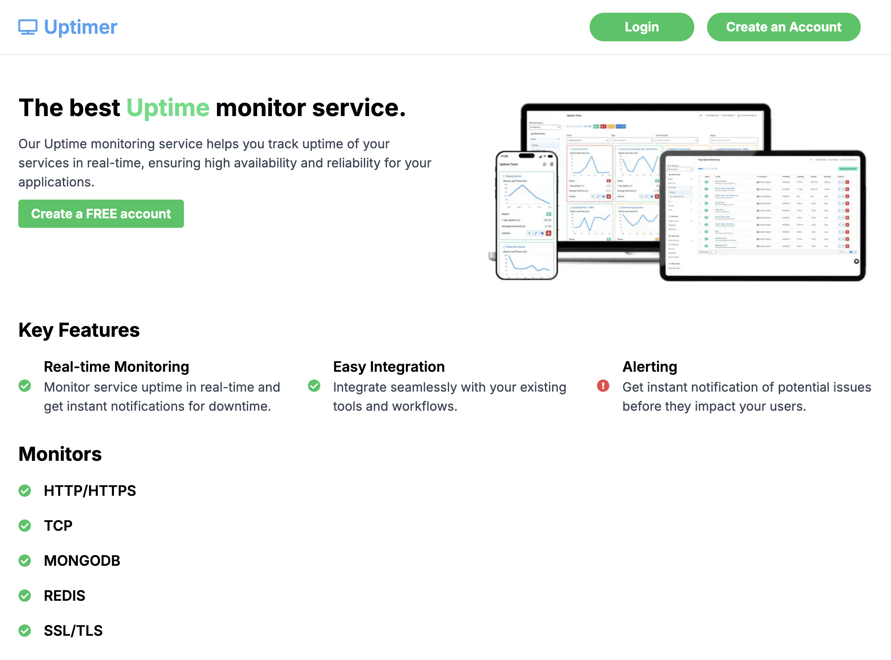
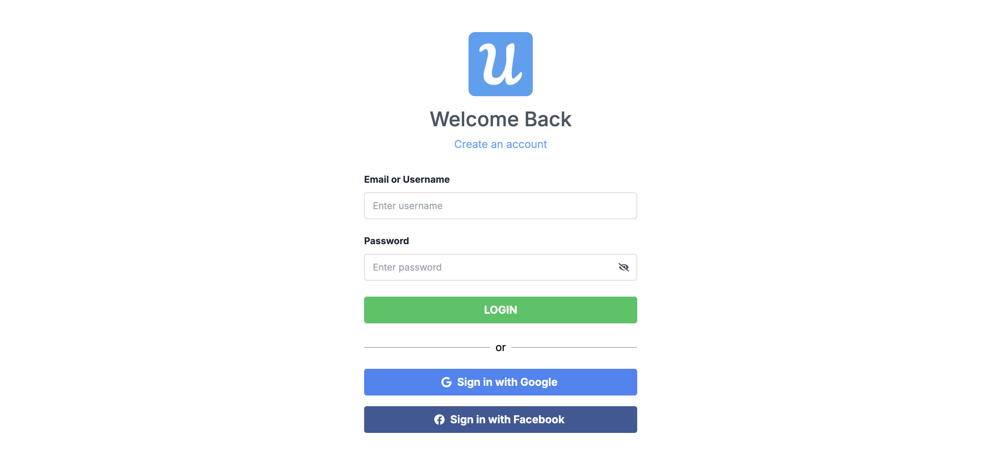
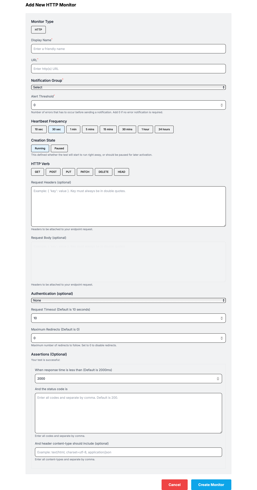
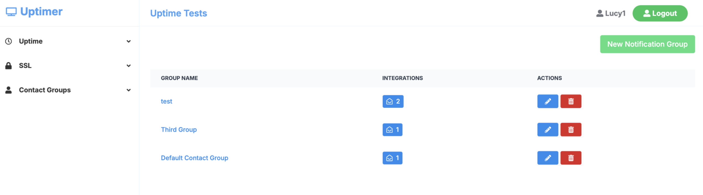
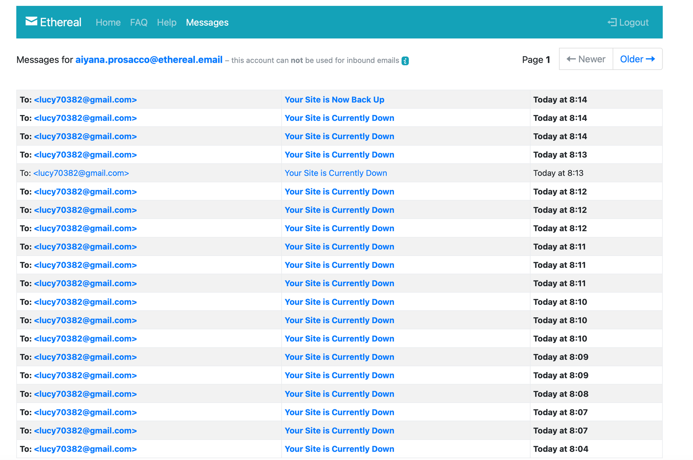
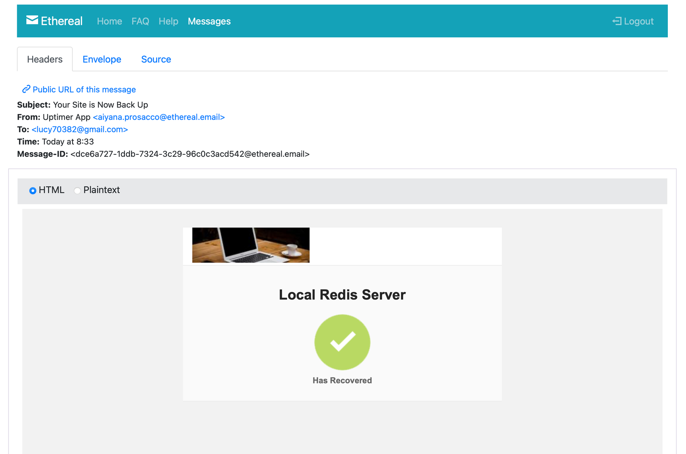
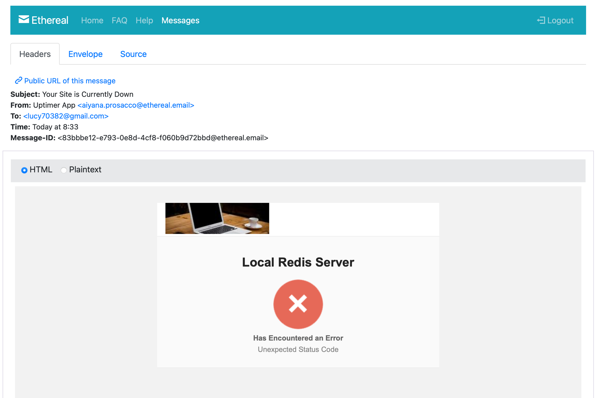
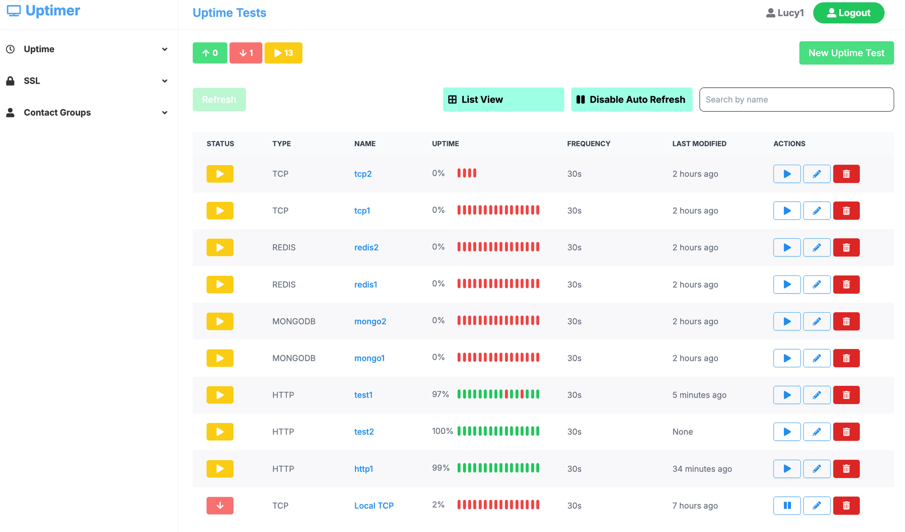
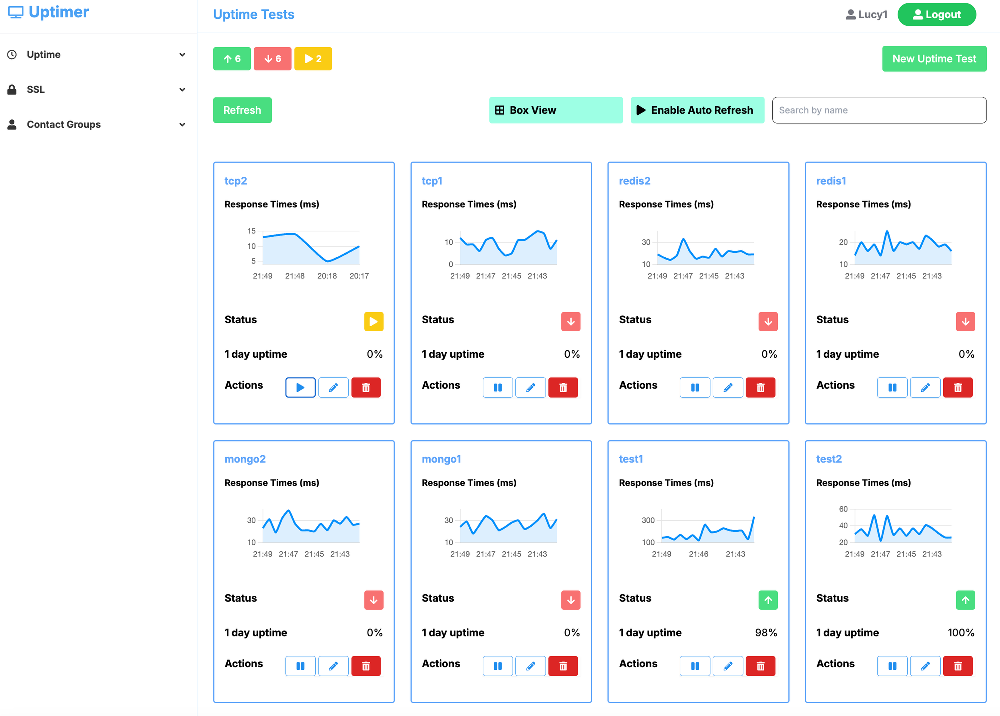
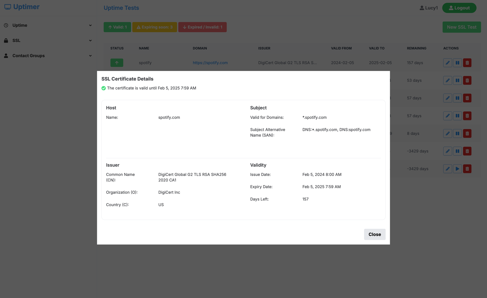

# Uptime Monitoring 系統專案

## 專案概覽
此專案為 Uptime Monitoring 系統前端/後端專案。

專案包含三個主要部分：

1. **[project-setup](https://github.com/LucyYeung/UptimerApp/tree/master/project-setup)**
 提供 Docker Compose 檔案建置 PostgreSQL、MongoDB 和 Redis 服務，用於測試此專案相關監控功能是否正常。
2. **[uptime-client](https://github.com/LucyYeung/UptimerApp/tree/master/uptimer-client)**
  前端應用，使用 Next.js 框架、Tailwind CSS、GraphQL client (Websocket) 等技術建構，提供監控數據的可視化操作界面。
3. **[uptime-server](https://github.com/LucyYeung/UptimerApp/tree/master/uptimer-server)**
  後端應用，使用 GraphQL server 和 Express 服務等架構，負責處理程式邏輯、資料處理及排程 。

**詳細使用之技術請參閱各個資料夾內的 README。**

## 專案特色

**多元登入**

支援一般帳號、Facebook、Google 登入方式，讓您使用更方便。

**自定義監控設置**

支援自定義設定監控類型、警報閾值、頻率等，依照使用者的需求調整。

**即時監控**

使用排程與 WebSockets 自動監控服務即時的運行狀況，並在服務中斷時立即發送至指定聯絡人之 Email。

**一站式檢測多項資源**

提供多種監控類型，同時達成檢測網站、API、資料庫狀態的需求，全面掌握服務健康情況。

**SSL/TLS 憑證監控**

即時監控網站的 SSL/TLS 憑證狀態，可提前發現過期或配置問題，保障網站安全性。

